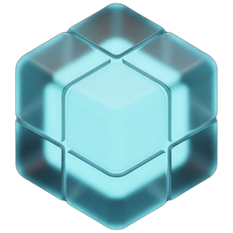
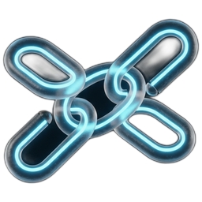
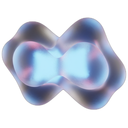
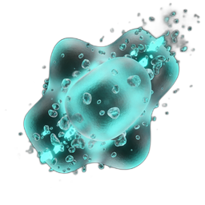
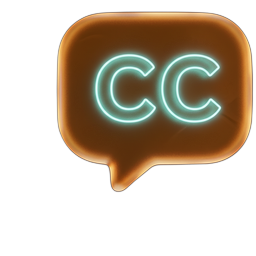
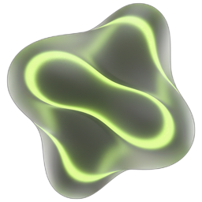

# ✨ ContextUp 상세 기능 가이드

> **[At a Glance]**
> ContextUp은 윈도우 우클릭 메뉴를 통해 파일 관리, 미디어 편집, 그리고 최첨단 로컬 AI 기능을 즉각적으로 제공하는 생산성 플랫폼입니다.
> - **Core**: 매니저, 트레이 앱, 퀵 메뉴를 통한 통합 제어 인터페이스 제공
> - **Tiers**: 무설치 수준의 1단계부터 고성능 GPU AI 모델을 구동하는 3단계까지 선택적 설치 가능
> - **DCC Link**: 블렌더, ComfyUI 등 전문 도구와의 고도화된 워크플로우 연동 지원

---

## 🖥️ Core Interface (관리 인터페이스)
**ContextUp의 모든 동작을 제어하는 3대 핵심 사용자 환경입니다.**

| 구성 요소 | 주요 기능 | 상세 설명 |
| :--- | :--- | :--- |
| **Manager** ⚙️ | 통합 제어판 | 메뉴 항목 커스터마이징, API 키 관리, 외부 도구 경로 설정 및 시스템 최적화 |
| **Tray Agent** 🛠️ | 상시 가동 엔진 | 전역 단축키 감지, 실시간 메뉴 동기화 및 백그라운드 서비스 모니터링 |
| **Quick Menu** ⚡ | 고속 팝업 창 | 작업 중인 파일 형식에 맞춤화된 도구를 소환하는 컨텍스트 기반 런처 (`Ctrl+Shift+C`) |

---

## 🟢 1단계: 최소 설치 (Minimal) - 약 +15개 기능
**시스템 기본 라이브러리(Pillow, pywin32)만 사용하는 초경량 필수 유틸리티입니다.**

| 카테고리 | 아이콘 | 영문 이름 | 한글 이름 | 기능 소개 | 비고 |
| :--- | :---: | :--- | :--- | :--- | :--- |
| **System** |  | **Finder** | 파인더 | 고속 해싱으로 중복 및 대용량 파일을 정교하게 탐색 및 관리 | `Alt+Space` |
| **System** |  | **Clean Folder** | 빈 폴더 정리 | 비어있는 모든 하위 디렉토리를 탐색하여 불필요한 구조 일괄 제거 | 기본 내장 |
| **System** |  | **Move to New** | 새 폴더로 이동 | 선택된 항목들을 담을 새 폴더를 즉시 생성 및 안전하게 이동 | Shell API |
| **System** |  | **Reopen Recent** | 최근 폴더 열기 | 실수로 닫은 탐색기 창을 트레이 기록에서 찾아 즉시 복원 | Tray Agent |
| **Clipboard** |  | **Open Path** | 경로 열기 | 클립보드에 복사된 경로를 감지하여 해당 위치를 즉시 탐색기로 이동 | `Ctrl+Alt+V` |
| **Clipboard** |  | **Save Clip Img** | 이미지 저장 | 클립보드의 이미지 데이터를 감지하여 즉시 파일(PNG)로 저장 | Pillow |
| **Clipboard** |  | **Copy UNC Path** | UNC 경로 복사 | 네트워크 공유 폴더 호환 형식(`\\Server\Share\...`)으로 경로 복사 | Tray |
| **Clipboard** |  | **Paste to Folder** | 붙여넣어 생성 | 클립보드에 있는 파일들을 포함하는 새 폴더를 현재 위치에 즉시 생성 | Shell |
| **Document** |  | **PDF Merge** | PDF 병합 | 여러 개의 PDF 문서를 하나의 무결성 있는 파일로 통합 | pypdf |
| **Document** |  | **PDF Split** | PDF 분할 | 다페이지 PDF를 개별 페이지 또는 지정 범위로 정밀 분할 | pypdf |
| **Tools** |  | **Video Downloader** | 영상 다운로드 | 스트리밍 영상 및 음원을 로컬 환경으로 저장 | yt-dlp |

---

## 🟡 2단계: 표준 설치 (Standard) - 약 +25개 기능
**미디어 편집(FFmpeg, OpenCV)과 API AI를 활용한 생산성 강화 환경입니다.**

| 카테고리 | 아이콘 | 영문 이름 | 한글 이름 | 기능 소개 | 비고 |
| :--- | :---: | :--- | :--- | :--- | :--- |
| **Image** |  | **Img Convert** | 이미지 변환 | 수십 종의 특수 포맷 및 최신 포맷을 고화질 무손실 상호 변환 | OpenCV |
| **Image** |  | **Noise Master** | 노이즈 마스터 | 레이어 기반 텍스처 및 노이즈(Perlin, Gradient 등) 생성 도구 | Python |
| **Video** |  | **Vid Convert** | 영상 변환 | 비트레이트 제어 및 코덱 변환을 통한 용량/호환성 최적화 | FFmpeg (자동 설치) |
| **Video** |  | **Interp 30fps** | 30fps 보간 | 저프레임 영상을 30fps로 부드럽게 변환 (Minterpolate) | FFmpeg (자동 설치) |
| **Video** |  | **Extract Audio** | 오디오 추출 | 영상에서 오디오 트랙만 원본 무손실 또는 MP3로 추출 | FFmpeg |
| **Video** |  | **Remove Audio** | 오디오 제거 | 영상의 오디오 트랙을 제거하여 무음 영상 생성 | FFmpeg |
| **Tools** |  | **AI Text Lab** | 텍스트 연구소 | Gemini/Ollama 기반 텍스트 번역, 정제 및 스타일 변환 | API Key |
| **Tools** |  | **Leave Manager** | 휴가 관리 | 연차/휴가 사용 내역을 시각적으로 관리하고 잔여일 계산 | 트레이 전용 |
| **Document** |  | **Doc Convert** | 문서 변환 | PDF를 워드로 변환하거나 이미지/PDF에서 텍스트 추출 | pdf2docx |
| **AI Light** |  | **Gemini Tool** | Gemini AI 분석 | 클라우드 기반 비전 AI를 활용한 이미지 맥락 분석 및 데이터 추출 | Gemini API |

---

## 🔴 3단계: 전체 설치 (AI Heavy) - 약 +20개 기능
**내장 로컬 AI 엔진(Torch, ONNX)을 구동하여 고부하 작업을 독립적으로 처리합니다.**

| 카테고리 | 아이콘 | 영문 이름 | 한글 이름 | 기술적 소개 | 비고 (Repository) |
| :--- | :---: | :--- | :--- | :--- | :--- |
| **AI Heavy** |  | **BG Removal** | 배경 제거 | Deep Learning 기반 Salient Object Detection을 통한 정교한 마스킹 | [Rembg](https://github.com/danielgatis/rembg) / [BiRefNet](https://github.com/ZhengPeng7/BiRefNet) |
| **AI Heavy** |  | **AI Upscale** | AI 업스케일 | SRGAN 모델을 사용하여 이미지의 고주파 디테일 재구성 및 해상도 복원 | Real-ESRGAN (자동 설치) |
| **AI Heavy** |  | **Whisper AI** | Whisper 자막 | Robust Speech-to-Text 엔진을 활용한 고정밀 오디오 전사 및 동기화 | [Faster-Whisper](https://github.com/SYSTRAN/faster-whisper) |
| **AI Heavy** |  | **Marigold PBR** | PBR 맵 생성 | Diffusion 모델 기반 Monocular Depth Estimation을 통한 3D 텍스처 추출 | [Marigold](https://github.com/prs-eth/Marigold) |
| **AI Heavy** |  | **Demucs Stems** | 음원 분리 | Source Separation 기법을 응용하여 오디오 요소를 트랙별로 완전 분리 | [Meta Demucs](https://github.com/facebookresearch/demucs) |

---

## 🏗️ DCC & Professional Link - 외부 도구 연동 기능 (약 +10개)
**자동 설치되지 않으며**, 사용자의 PC에 설치된 전문 소프트웨어나 포터블 버전을 연결해야 활성화되는 고사양 기능입니다.

> [!NOTE]
> FFmpeg, Real-ESRGAN, Whisper 등의 핵심 도구와 라이브러리는 **1~3단계 설치 과정에서 자동으로 구성**되므로 별도의 수동 연동이 필요하지 않습니다.

| 카테고리 | 아이콘 | 기능 이름 | 한글 이름 | 연동 필수 도구 | 기능 설명 |
| :--- | :---: | :--- | :--- | :--- | :--- |
| **3D Content** |  | **Remesh & Bake** | 리메쉬 및 베이크 | **Blender** | 블렌더 엔진과 연동하여 고폴리곤 매쉬를 재구축하고 텍스처를 굽습니다. |
| **3D Content** |  | **Mesh Convert** | 매쉬 변환 전문 | **Blender / Mayo** | FBX, OBJ, GLB 등 복잡한 3D 데이터 포맷 간의 상호 변환을 지원합니다. |
| **3D Content** |  | **Open with Mayo** | Mayo로 열기 | **Mayo** | 3D CAD 파일(STEP, IGES)을 경량 뷰어인 Mayo로 즉시 엽니다. |
| **Advanced AI** |  | **SeedVR2** | AI 영상 개선 | **ComfyUI** | ComfyUI 워크플로우를 소환하여 영상 화질을 시네마틱 급으로 향상시킵니다. |
| **Audio Space** |  | **Creative Audio Studio (ACE)** | ACE 오디오 편집 | **ComfyUI** | ComfyUI 기반 오디오 생성/리페인팅 및 고도화된 음성 변조 작업을 지원합니다. |
| **Creative** |  | **Creative Studio (Z)** | 크리에이티브 (Z) | **ComfyUI** | Z-Image Turbo를 활용한 초고속 이미지 생성 워크스페이스. 프롬프트 레이어와 배치 생성 지원. |
| **Creative** |  | **Creative Studio (Advanced)** | 크리에이티브 (고급) | **ComfyUI** | 체크포인트 선택, 다중 LoRA 스택, FaceDetailer, SUPIR 등 전문가용 옵션을 제공하는 고급 워크스페이스. |
| **Management** |  | **Open Web UI** | ComfyUI Web UI | **ComfyUI** | ComfyUI 웹 UI를 열고 서버가 꺼져 있으면 자동으로 시작합니다. |

> [!TIP]
> 위 기능들은 **Manager(매니저) -> 🛠️ Preferences** 메뉴에서 해당 소프트웨어의 실행 파일(.exe) 경로를 연결한 후 사용이 가능합니다.
